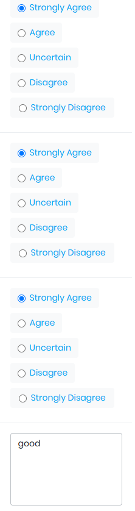

# Auto Select and Comment Chrome Extension

A Chrome extension to simplify form-filling by automating the selection of options (radio buttons or checkboxes) and optionally auto-filling comment boxes.

---

## Features

- Automatically selects a specific option (radio or checkbox) for all questions.
- Optional auto-fill feature for textareas with user-defined comments.
- Streamlines repetitive form-filling tasks.

---

## Installation

### Clone the Repository

```
git clone https://github.com/your-username/auto-select-comment-extension.git
cd auto-select-comment-extension

```

### Import the Extension into Chrome
Open Google Chrome.
1. Navigate to chrome://extensions/.
2. Enable Developer Mode by toggling the switch in the top-right corner.
3. Click on Load unpacked.
4. Select the folder where you cloned this repository.
6. The extension will now appear in your browser's extensions list.
7. Pin the extension for quick access by clicking the extensions icon (puzzle piece) and pinning it.


## Usage

### Open the Target Form Page

Navigate to the webpage containing the form you want to fill out.

### Use the Extension

1. Click on the extension icon in the Chrome toolbar.
2. A popup will appear with the following options:
   - **Select an Option**: Choose the desired option (e.g., "Strongly Agree").
   - **Auto-Fill Comment**: Enter a comment to auto-fill into textareas (leave blank if you want to manually input comments).
3. Click the **Apply** button.

### Verify and Submit

1. The selected option will be applied to all applicable questions.
2. Comments will be auto-filled or left for manual input, as specified.
3. Review the form, make any necessary adjustments, and submit it.

## Screenshots

### Popup Interface
*()*

### Automated Selection
*()*

## Development

### Prerequisites

- Ensure you have the latest version of **Google Chrome** installed.

### Modify the Code

1. To customize or enhance the extension, modify the files in the repository.
2. Reload the extension in Chrome after making changes:
   - Go to `chrome://extensions/`.
   - Click **Reload** for your extension.

### Debugging

1. Use Chrome DevTools for debugging:
   - Right-click on a page and select **Inspect**.
   - Go to the **Console** tab to see logs from the extension.

## Contributing

Contributions are welcome! Feel free to fork the repository, make changes, and submit a pull request.

## License

This project is licensed under the MIT License. See the [LICENSE](LICENSE) file for details.
