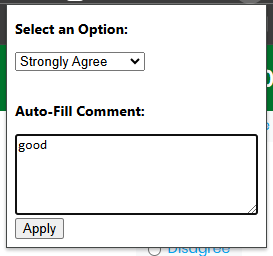
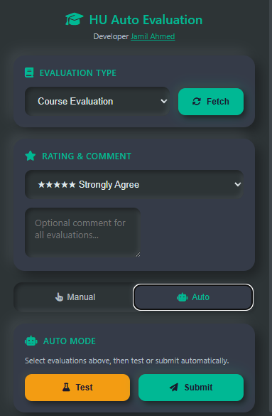

# Auto Select Option - HU Evaluation Extension

Automatically fill and submit **Course** and **Teacher** evaluations for Hamdard University Student Portal.

## ✨ Features

### v3.0 - Work From Any Page
- **Fetch Pending**: Get all pending evaluations from any portal page
- **Manual Mode**: Click to navigate, apply to current page
- **Auto Mode**: Select & submit multiple evaluations automatically
- **Login Detection**: Alerts if not logged in

### Core Features
- Select rating (Strongly Agree → Strongly Disagree)
- Auto-fill comments
- Works with Course & Teacher evaluations
- Neomorphic dark UI

---

## 📦 Installation

1. Download or clone this repository
2. Open Chrome → `chrome://extensions/`
3. Enable **Developer mode**
4. Click **Load unpacked** → Select folder

---

## 🎯 How to Use

### Auto Mode (Recommended)
1. Login to [sp.hamdard.edu.pk](https://sp.hamdard.edu.pk)
2. Click extension icon
3. Select **Course** or **Teacher** evaluation
4. Click **Fetch** to load pending
5. Check evaluations to process
6. Select rating & comment
7. Click **Test** or **Submit**

### Manual Mode
1. Click **→** on any pending item to navigate
2. Click **Apply to Current Page** to fill form
3. Manually submit

---

## 📸 Screenshots

---

## ⚙️ Technical

| Feature | Value |
|---------|-------|
| Version | 3.0 |
| Manifest | v3 |
| Permissions | activeTab, scripting, tabs, storage |

---

## ⚠️ Important

- **Cannot undo** submitted evaluations
- **Must be logged in** to use
- **2.5s delay** between submissions

---

## 🔧 Troubleshooting

| Issue | Solution |
|-------|----------|
| "Not logged in" | Login to portal first |
| No evaluations | Click Fetch button |
| Extension error | Reload at chrome://extensions |

---

## 👨‍💻 Author

Made by [Jamil Ahmed](https://www.linkedin.com/in/jamil-ahmed-54655220b/)

[GitHub Repository](https://github.com/jamilahmed2/autoselectoption)
